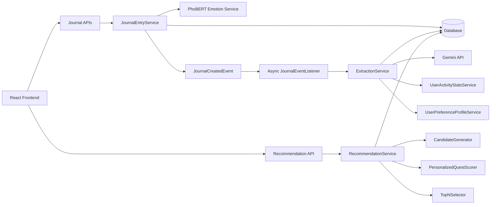
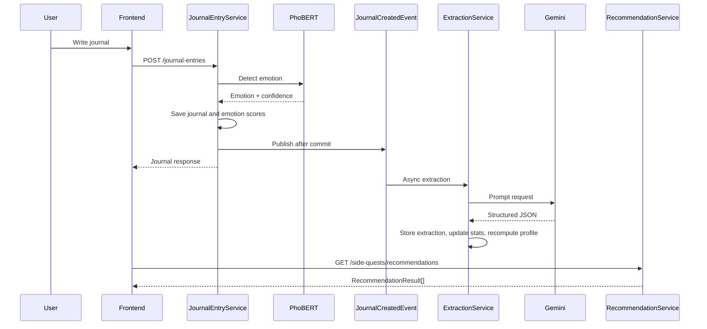

# Aura AI Recommendation System - Final Integration

## Project Summary

The final AI recommendation workflow is integrated end to end:

1. User writes a journal entry.
2. PhoBERT emotion detection runs synchronously during journal creation.
3. Journal entry, emotion scores, streak, and initial side quest assignments are saved.
4. `JournalCreatedEvent` is published after the transaction commits.
5. `JournalEventListener` handles the event asynchronously.
6. `ExtractionService` calls Gemini, validates JSON, stores `JournalExtraction`, updates `UserActivityStat`, and recomputes `UserPreferenceProfile`.
7. `RecommendationService` generates deterministic personalized recommendations through `CandidateGenerator`, `PersonalizedQuestScorer`, and `TopNSelector`.
8. Frontend consumes `RecommendationResult`, renders the quest, explanation, and confidence when available.
9. If extraction or recommendation fails, journal creation remains successful and the frontend falls back gracefully.

## Architecture Summary



## Recommendation Pipeline



## API Documentation

### Journal APIs

`POST /journal-entries`

Authentication: required.

Request body:

```json
{
  "journalContent": "Today I walked outside and felt calmer.",
  "noteToSelf": "Keep the habit.",
  "memoryPhoto": "/uploads/photo.jpg",
  "tags": ["walk", "calm"]
}
```

Response: `ApiResponse<JournalEntryResponse>`.

Error cases:

- `401/403`: unauthenticated or unauthorized.
- Emotion service failure is handled by existing emotion service behavior.
- Async Gemini failure does not fail journal creation.

`GET /journal-entries/{id}/extraction`

Authentication: required. Ownership-scoped.

Response: `ApiResponse<JournalExtractionResponse | null>`.

Security: `rawLlmResponse`, prompt text, and Gemini metadata are never mapped to DTO.

### Profile APIs

`GET /users/me/profile`

Authentication: required.

Response: `ApiResponse<UserPreferenceProfileResponse | null>`.

`GET /users/me/extractions?page=0&size=10`

Authentication: required.

Response: paginated extraction summaries for the authenticated user only.

### Recommendation APIs

`GET /side-quests/recommendations?emotion=HAPPY&limit=3`

Authentication: required.

Response:

```json
{
  "code": 1000,
  "result": [
    {
      "quest": {
        "id": 1,
        "title": "Take a mindful walk",
        "description": "Spend five minutes walking slowly.",
        "xpReward": 20,
        "emotion": "HAPPY",
        "category": "MINDFULNESS"
      },
      "score": 0.86,
      "explanations": [
        "Aligns with your recent emotion: HAPPY"
      ],
      "confidence": 0.86,
      "recommendationTime": "2026-07-19T01:20:00"
    }
  ]
}
```

Error cases:

- Empty candidate pool returns an empty list.
- Invalid emotion query is rejected by Spring enum binding.
- Internal scoring details are not exposed.

Backward compatibility:

- `GET /side-quests`
- `GET /side-quests/emotion/{emotion}`

remain unchanged and continue returning `SideQuestResponse`.

## Security Verification

- `rawLlmResponse` is persisted for audit only and is deliberately excluded by `JournalExtractionMapper`.
- Prompt content is loaded and sent inside `ExtractionService`; no API returns prompt text.
- Gemini API key remains in backend configuration and is never returned to the frontend.
- Extraction queries validate journal ownership before returning data.
- Profile queries use `CurrentUserService`, so users can only access their own profile.
- Recommendation endpoint uses the authenticated current user and does not accept a user ID parameter.

## Failure Recovery

- Gemini calls happen asynchronously after journal transaction commit.
- Journal creation is not blocked by Gemini latency or failure.
- Gemini call/JSON parsing retries up to 3 attempts inside `ExtractionService`.
- Failed extraction is logged with event name, journal ID, user ID, latency, error type, and message.
- Sensitive prompt and raw LLM response are not logged.
- Frontend recommendation load falls back to existing side quest API if recommendation endpoint fails.

## Performance Report

Runtime logs now emit timing fields:

- `event=JournalCreationCompleted ... latencyMs=...`
- `event=ExtractionCompleted ... latencyMs=...`
- `event=ExtractionFailed ... latencyMs=...`
- `event=RecommendationCompleted ... latencyMs=...`

Validated build/test performance on local integration run:

- Frontend lint: pass.
- Frontend production build: pass.
- Backend compile: pass.
- Backend test suite: pass.

Database query count and memory usage require running the application with a real database profiler or APM during demo data execution. The code paths are prepared with structured event logs for correlation.

## Integration Report

Verified components:

- PhoBERT emotion detection: integrated through `EmotionService`.
- `JournalCreatedEvent`: published after journal creation.
- `ExtractionService`: async Gemini extraction orchestration.
- Gemini integration: `ExtractionApiClient`.
- `JournalExtraction`: persisted extraction entity.
- `UserActivityStat`: updated after extraction.
- `UserPreferenceProfile`: recomputed after extraction and scorer cache invalidated.
- `RecommendationService`: deterministic orchestration.
- `CandidateGenerator`: strategy-based candidate selection.
- `PersonalizedQuestScorer`: personalized scoring and explanation generation.
- `RecommendationExplanation`: user-safe explanation model.
- `RecommendationResult`: DTO response for frontend.

## Production Checklist

- No synchronous Gemini calls in journal creation.
- No random recommendation in recommendation pipeline.
- DTO-only recommendation responses.
- Services orchestrate existing components.
- Calculator retains preference logic.
- Strategy pattern remains in candidate generation.
- Recommendation order is deterministic.
- Existing side quest APIs remain compatible.
- Existing tests pass.
- Sensitive AI response and prompt data are not exposed.

## Known Limitations

- Database query count and memory usage are not automatically exported; use datasource logging/APM for thesis demo measurements.
- Recommendation history persistence is not introduced in this milestone to avoid new architecture.
- Frontend shows the first explanation per quest to preserve the existing compact card layout.

## Future Improvements

- Add persisted recommendation history after demonstration freeze.
- Add Micrometer metrics for extraction/recommendation latency and query counts.
- Add admin-only observability dashboard for extraction failures.
- Add offline Gemini mock mode for fully deterministic demo rehearsals.
